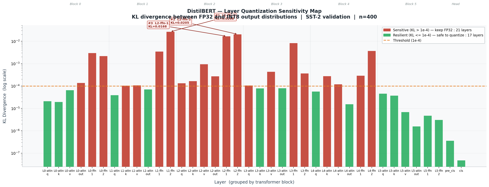
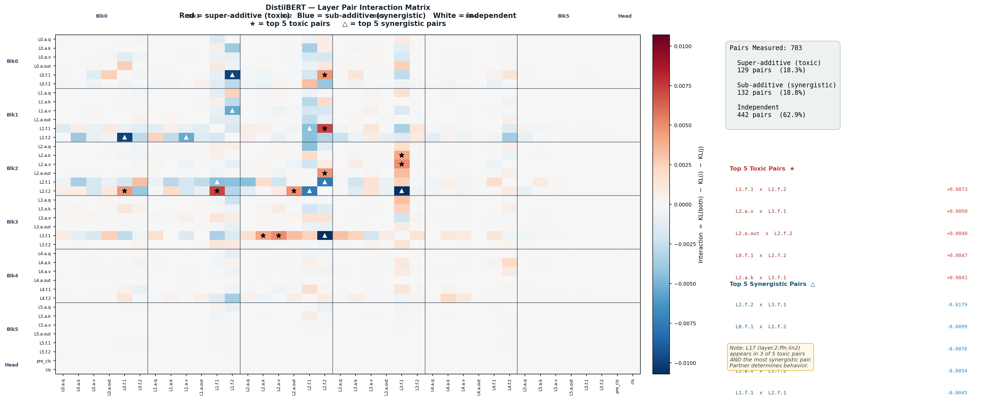

# DistilBERT Layer Quantization Sensitivity Profiler

A diagnostic and optimization tool that maps quantization sensitivity at the individual layer level, measures pairwise layer interactions, and compiles a mixed-precision model using those measurements.

Built entirely on CPU. No GPU required.

---



*Each bar shows how much quantizing that layer alone disturbs the model's output distribution (KL divergence). Red = sensitive. Green = resilient. The pattern reveals that early/middle FFN layers dominate sensitivity due to error compounding through downstream layers.*

---

## Motivation

Most quantization tools apply INT8 uniformly across the entire model. This works, but it makes an assumption that is often wrong: that all layers tolerate precision loss equally. Some layers are highly sensitive — quantizing them degrades accuracy measurably. Others are nearly unaffected. Blind compression doesn't know the difference.

This project builds the measurement infrastructure that does:

1. A **sensitivity profiler** that isolates each layer, quantizes it individually, and records the KL divergence between the original and compressed output distributions.
2. A **pairwise interaction profiler** that measures whether two layers' sensitivities are independent or whether quantizing them together causes more or less damage than predicted.
3. An **interaction-aware greedy compiler** that uses both measurements to make smarter quantization decisions than a binary threshold approach.

A secondary goal: this runs entirely on CPU. If you have a laptop, you can run, modify, and extend every part of this.

---

## Final Results

| Model | Accuracy | Drop | Latency | Speedup | Size | INT8 Layers |
|---|---|---|---|---|---|---|
| FP32 PyTorch | 91.25% | — | 24.52ms | 1.00x | 255MB | 0/38 |
| ONNX Full INT8 | 90.50% | −0.75% | 7.79ms | 3.15x | 64.2MB | 38/38 |
| Step5 Binary | 91.25% | 0.00% | 22.91ms | 1.15x | 218.3MB | 17/38 |
| **Step9 Greedy** | **91.25%** | **0.00%** | **21.41ms** | **1.27x** | **208.2MB** | **20/38** |

The greedy compiler quantized 3 more layers than the binary approach while maintaining identical accuracy. ONNX Runtime achieves higher speed by combining full INT8 quantization with graph-level optimizations (operator fusion, INT8 arithmetic kernels). These tools solve different problems: ONNX optimizes for maximum speed, this project optimizes for accuracy-preserving compression with principled layer selection.

---

## How It Works

### Part 1 — Sensitivity Profiler (Steps 1–6)

**The core experiment:** take the full FP32 model. Quantize exactly one layer to INT8. Measure the KL divergence between the original and quantized model's output distributions. Restore the layer. Repeat for every layer.

```
KL divergence = measure of how much the output probability distribution shifted
              = 0 if quantization changed nothing
              > 0 if the distribution shifted — higher means more sensitive
```

Hard classification accuracy was the first metric tried. It failed: on a well-trained model with clear-cut examples, quantization shifts logits slightly but rarely flips a prediction. Every layer returned the same accuracy score regardless of which was quantized. KL divergence is continuous — it detects distribution shift even when no prediction changes. That switch made the profiler work.

**Why early layers are more sensitive:**

Think of DistilBERT as a chain of 38 workers passing a message. If Worker 1 introduces an error, that error propagates through Workers 2–37 before the final answer is produced — each subsequent worker compounds it. If Worker 37 introduces an error, it reaches the output in one step. This is why blocks 0–4 show KL scores 100–1000× higher than block 5, even for equivalent layer types.

**Why FFN layers are more sensitive than attention layers:**

FFN lin1 layers are 3072×768 = 2.3M parameters. Attention layers are 768×768 = 590K. More parameters means more total quantization rounding error accumulated. Combined with their early position in the network, FFN layers in blocks 1–3 are the most sensitive in the model.

### Part 2 — Interaction Profiler and Greedy Compiler (Steps 7–10)

**The problem with binary decisions:**

The sensitivity scan measures each layer in isolation — all others at perfect FP32. When the binary compiler then quantizes 17 layers simultaneously, it assumes those 17 isolated scores add independently. That assumption is wrong for 37% of all layer pairs.

**The pairwise interaction experiment:**

For every pair (i, j), quantize both simultaneously and compute:

```
Interaction(i, j) = KL(both i and j quantized) − KL(i alone) − KL(j alone)
```

Positive = super-additive (errors compound — dangerous pair)
Near zero = independent (binary assumption holds for this pair)
Negative = sub-additive (errors cancel — safer to compress both than either alone)

703 pairs measured. 129 super-additive, 132 sub-additive, 442 independent.



*Red = toxic pairs. Blue = synergistic pairs. White = independent. Stars mark the top 5 toxic pairs; triangles mark the top 5 synergistic pairs.*

**The greedy compiler:**

Uses the interaction matrix to make sequential quantization decisions. After committing each layer, every remaining layer's estimated cost is updated via the matrix row of the committed layer. This allows the compiler to discover that a layer appearing sensitive in isolation becomes safe given what is already compressed — without testing all 2³⁸ combinations.

**The v1 failure and v2 fix:**

v1 trusted the matrix completely and quantized 36 of 38 layers. Real accuracy dropped 1.25%. Root cause: pairwise interactions are a second-order approximation. When 36 layers are quantized simultaneously, higher-order effects dominate in ways the 2D matrix cannot model.

v2 adds empirical validation every 5 committed layers: build the current partial model and measure its real KL against FP32. If real KL exceeds the limit, roll back. The matrix guides direction. Reality sets the hard limit.

**Result:** 20 layers quantized, 0% accuracy drop, 1.27x speedup — 3 more layers than the binary approach at identical accuracy.

---

## Installation

```bash
git clone https://github.com/abhaykaisare/distilbert-sensitivity-profiler
cd distilbert-sensitivity-profiler
pip install -r requirements.txt
```

Python 3.9+. No GPU required.

---

## Usage

```bash
# Part 1: Sensitivity Profiler
python step1_explore_model.py              # maps all 38 layers
python step2_single_layer_quant.py         # verifies KL metric
python step3_sensitivity_scan.py           # full scan ~10 min, resumable
python step4_plot_map.py                   # sensitivity_map.png
python step5_mixed_precision_compiler.py   # binary compiler + benchmark
python step6_final_demo.py                 # inference demo
python step6_final_demo.py "your text"     # custom sentence

# Part 2: Interaction Profiler and Greedy Compiler
python step7_pairwise_profiler.py          # pairwise scan ~3 hrs, resumable
python step8_visualize_matrix.py           # interaction_heatmap.png
python step9_iterative_compiler.py         # greedy compiler + benchmark
python step10_onnx_comparison.py           # four-way comparison vs ONNX
```

Steps 3 and 7 checkpoint after every layer/pair. Re-run after interruption to continue.

---

## Project Structure

```
├── step1_explore_model.py
├── step2_single_layer_quant.py
├── step3_sensitivity_scan.py
├── step4_plot_map.py
├── step5_mixed_precision_compiler.py
├── step6_final_demo.py
├── step7_pairwise_profiler.py
├── step8_visualize_matrix.py
├── step9_iterative_compiler.py
├── step10_onnx_comparison.py
│
├── sensitivity_results.json         38 layers × KL score
├── pairwise_kl_scores.json          703 pairs × combined KL
├── interaction_matrix.npy           38×38 interaction matrix
├── sensitivity_map.png
├── interaction_heatmap.png
├── docs/requirements.txt
│
├── 1_baseline_benchmark.py          ONNX baseline reference
├── 2_optimize_and_quantize.py       ONNX full INT8 export
└── 3_final_benchmark.py             ONNX benchmark
```

---

## Key Findings

**1. Sensitivity follows a predictable structure.**
Early and middle FFN layers (blocks 1–4) are the most sensitive. Final block layers and the classifier head are the most resilient. Position in the network — and therefore downstream error amplification — is the dominant factor.

**2. The independence assumption holds for 63% of pairs and fails for 37%.**
703 pairwise experiments showed 18.4% of pairs are super-additive (more dangerous together than predicted) and 18.8% are sub-additive (safer together than predicted). Any binary threshold compiler ignores this structure entirely.

**3. Sensitivity is not a fixed property of a layer.**
The same layer can appear in the top 5 most toxic pairs AND the most synergistic pair depending solely on its partner. layer.2.ffn.lin2, one of the most sensitive layers in isolation, has a strong synergistic interaction with layer.3.ffn.lin1 — quantizing both together causes less damage than quantizing either alone.

**4. Pairwise interactions are a useful but optimistic approximation.**
The greedy compiler using only the matrix over-committed to 36 layers with a 1.25% accuracy drop. Higher-order interactions dominate when many layers are quantized simultaneously. Empirical validation every 5 steps corrects for this.

**5. PyTorch dynamic quantization's speedup comes from memory bandwidth, not arithmetic.**
INT8 weights are 1 byte vs 4 bytes FP32 — 4x fewer bytes read from memory per forward pass. Arithmetic still runs in FP32 after dequantization. ONNX additionally uses INT8 arithmetic via Intel VNNI, which is the source of its additional speedup.

---

## Why ONNX Is Smaller and Faster

ONNX at 64.2 MB vs our 208.2 MB: ONNX quantized all 38 layers including the large FFN layers (2.3M params each). We protected those layers. We quantized the small attention layers (590K params each). We compressed the cheap workers and protected the expensive ones — correct for accuracy, modest for size and speed.

ONNX's 3.15x speedup combines memory bandwidth savings (INT8 weights) with ONNX Runtime graph optimizations and INT8 arithmetic kernels. Our 1.27x comes from memory bandwidth only.

The natural extension: export this project's layer selection to ONNX format, applying INT8 arithmetic only to layers the profiler identifies as safe. That would combine accuracy preservation with ONNX's execution speed.

---

## Limitations and Future Work

- **Pairwise-only interactions.** Triplet and higher-order effects are not measured. Addressed in v2 via empirical validation, but a Hessian-based approach (HAWQ) would be more principled.
- **Single task and architecture.** Sensitivity maps differ for other tasks and models. Swap `MODEL_NAME` to profile any HuggingFace classification model.
- **Binary quantization format.** Extensions: block-wise INT4 for resilient layers, activation quantization, GPTQ-style calibration.
- **Reactive interaction use.** The compiler updates scores after each commit. A proactive approach would pre-filter toxic layers and pre-group synergistic clusters before the search begins.

---

## References

- [HAWQ: Hessian AWare Quantization](https://arxiv.org/abs/1905.03696)
- [SmoothQuant](https://arxiv.org/abs/2211.10438)
- [ZeroQuant](https://arxiv.org/abs/2206.01861)
- [PyTorch Quantization](https://pytorch.org/docs/stable/quantization.html)
- [The Illustrated BERT — Jay Alammar](https://jalammar.github.io/illustrated-bert/)